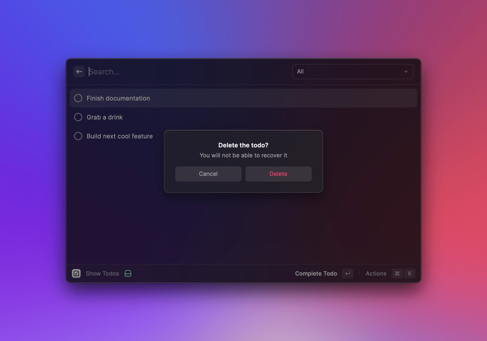

# Alert

When the user takes an important action (for example when irreversibly deleting something), you can ask for confirmation by using `confirmAlert`.



## API Reference

### confirmAlert

Creates and shows a confirmation Alert with the given [options](#alert.options).

#### Signature

```typescript
async function confirmAlert(options: Alert.Options): Promise<boolean>;
```

#### Example

```typescript
import { confirmAlert } from "@raycast/api";

export default async function Command() {
  if (await confirmAlert({ title: "Are you sure?" })) {
    console.log("confirmed");
    // do something
  } else {
    console.log("canceled");
  }
}
```

#### Parameters

| Name | Description | Type |
| :--- | :--- | :--- |
| options<mark style="color:red;">*</mark> | The options used to create the Alert. | <code>[Alert.Options](alert.md#alert.options)</code> |

#### Return

A Promise that resolves to a boolean when the user triggers one of the actions.
It will be `true` for the primary Action, `false` for the dismiss Action.

## Types

### Alert.Options

The options to create an Alert.

#### Example

```typescript
import { Alert, confirmAlert } from "@raycast/api";

export default async function Command() {
  const options: Alert.Options = {
    title: "Finished cooking",
    message: "Delicious pasta for lunch",
    primaryAction: {
      title: "Do something",
      onAction: () => {
        // while you can register a handler for an action, it's more elegant
        // to use the `if (await confirmAlert(...)) { ... }` pattern
        console.log("The alert action has been triggered");
      },
    },
  };
  await confirmAlert(options);
}
```

#### Properties

| Property | Description | Type |
| :--- | :--- | :--- |
| title<mark style="color:red;">*</mark> | The title of an alert. Displayed below the icon. | <code>string</code> |
| dismissAction | The Action to dismiss the alert. There usually shouldn't be any side effects when the user takes this action. | <code>[Alert.ActionOptions](alert.md#alert.actionoptions)</code> |
| icon | The icon of an alert to illustrate the action. Displayed on the top. | <code>[Image.ImageLike](../user-interface/icons-and-images.md#image.imagelike)</code> |
| message | An additional message for an Alert. Useful to show more information, e.g. a confirmation message for a destructive action. | <code>string</code> |
| primaryAction | The primary Action the user can take. | <code>[Alert.ActionOptions](alert.md#alert.actionoptions)</code> |
| rememberUserChoice | If set to true, the Alert will also display a `Do not show this message again` checkbox. When checked, the answer is persisted and directly returned to the extension the next time the alert should be shown, without the user actually seeing the alert. | <code>boolean</code> |

### Alert.ActionOptions

The options to create an Alert Action.

#### Properties

| Property | Description | Type |
| :--- | :--- | :--- |
| title<mark style="color:red;">*</mark> | The title of the action. | <code>string</code> |
| style | The style of the action. | <code>[Alert.ActionStyle](alert.md#alert.actionstyle)</code> |
| onAction | A callback called when the action is triggered. | <code>() => void</code> |

### Alert.ActionStyle

Defines the visual style of an Action of the Alert.

Use [Alert.ActionStyle.Default](#alert.actionstyle) for confirmations of a positive action.
Use [Alert.ActionStyle.Destructive](#alert.actionstyle) for confirmations of a destructive action (eg. deleting a file).

#### Enumeration members

| Name        | Value                                                   |
| :---------- | :------------------------------------------------------ |
| Default     |      |
| Destructive |  |
| Cancel      |       |
